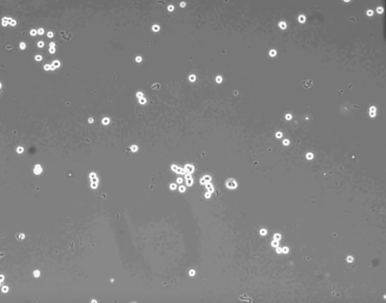

# FIJI-repro
Fluorescence analysis using FIJI software

# Sofware
Used Version: ImageJ 1.53q 
https://imagej.net/software/fiji/

# Data 
Valid for .tiff files for images and .ijm for macros

# Steps to be executed
1.  Open program via headless (not desktop)
2.	Add image to the command line 
3.	Run the macro to the command line
  - Remove/substract background
  - Apply Threshold	
  - Apply Fill holes
  - Convert to Mask
  - Apply Binary/Watershed
  - Analize particles
  - Store the output table

## Results
Generates a table with numerical data for counting the cells of the image treated with a macro

# Single steps: Macro and Commandline execution

Macro Code:

```
open("/tmp/cells-example01-8bits.tif");
run("Subtract Background...", "rolling=12");
setThreshold(72, 255, "raw");
setOption("BlackBackground", true);
run("Make Binary");
run("Fill Holes");
run("Convert to Mask");
run("Watershed");
run("Analyze Particles...", "  show=Nothing display");
saveAs("Results", "/tmp/results-cells-example01.csv");

```

Executing this Macro from Command line:

**Windows**

```C:/...../ImageJ.exe --ij2  --headless --console --run macros-cs/cs-01.ijm```

**MacOSX**

```./Fiji.app/Contents/MacOS/ImageJ-macosx  --ij2  --headless --console --run /tmp/macros-cs/cs-01.ijm```

**Linux**

```./ImageJ-macosx  --ij2  --headless --console --run /tmp/macros-cs/cs-01.ijm```

# Workflow

From the image:



To the results: 

[Cells-Extraction](results/results-cells-example01.csv)


